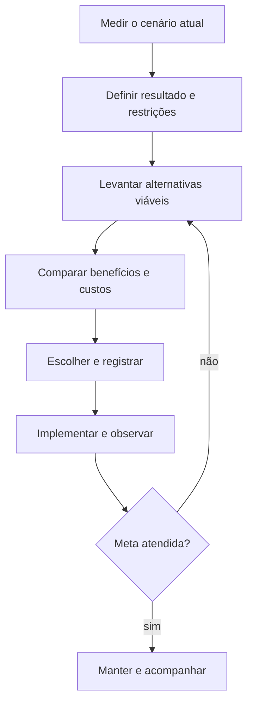

# Aula 01.2: Decisões arquiteturais e trade-offs

[Voltar para a Aula 01](aula-01-introducao.md)

[Revisitar a Aula 01.1: Requisitos de qualidade](aula-01-requisitos-qualidade.md)

Uma decisão arquitetural liga um problema relevante a uma escolha, às
alternativas descartadas e às evidências usadas para revisar o resultado.

## Objetivos

- Comparar alternativas a partir de requisitos e restrições.
- Explicitar benefícios, custos e riscos.
- Registrar uma decisão de forma curta e verificável.
- Reconhecer quando uma escolha precisa ser revista.

## Antes: tecnologia procurando um problema

> Vamos usar cache porque o sistema precisa escalar.

A frase não informa qual operação está lenta, qual carga foi observada, quanto
de desatualização é aceitável nem se o banco é realmente o gargalo. A equipe
assume o custo de invalidação sem saber como reconhecer sucesso.

## Depois: decisão guiada por evidência

O catálogo recebe 600 consultas por segundo durante campanhas. O percentil 95
da latência chegou a 900 ms, acima da meta de 300 ms, e as leituras repetidas de
descrições de produtos concentram a carga no banco. Preços e estoque não entram
no cache porque exigem atualização mais recente.

| Alternativa | Benefício | Custo ou risco |
|---|---|---|
| Aumentar o banco | Mudança pequena na aplicação | Custo recorrente e limite adiado |
| Cachear todo o produto | Grande redução de leitura | Preço ou estoque desatualizado |
| Cachear apenas descrições | Reduz leituras repetidas com risco limitado | Invalidação e novo componente |
| Não alterar | Nenhum custo imediato | Meta continua violada no pico |

A decisão é cachear apenas descrições por cinco minutos e medir taxa de acerto,
latência e respostas desatualizadas. O requisito e a evidência permanecem
visíveis junto da solução.

## Um registro de decisão enxuto

```text
Título: cachear descrições do catálogo durante campanhas
Estado: aceito
Contexto: p95 de 900 ms com meta de 300 ms; banco saturado por leituras repetidas
Decisão: cachear descrição por cinco minutos; preço e estoque permanecem fora
Alternativas: aumentar banco, cachear produto completo, não alterar
Consequências: menor carga; invalidação e observação do cache tornam-se necessárias
Evidência: p95, taxa de acerto e ocorrências de conteúdo desatualizado
Revisão: após a próxima campanha ou se a meta continuar violada
```

O registro não precisa contar toda a história do projeto. Ele preserva o
raciocínio que seria perdido quando o contexto mudasse ou pessoas deixassem a
equipe.

## Fluxo da decisão



## Restrições mudam a solução

Uma alternativa pode ser tecnicamente forte e ainda ser inadequada. Considere:

- prazo para entregar valor;
- orçamento de implantação e operação;
- conhecimento da equipe;
- tecnologia e contratos existentes;
- requisitos regulatórios;
- dependências externas;
- capacidade de testar e observar a solução.

Escolher um serviço gerenciado pode reduzir trabalho operacional e aumentar
custo ou dependência do fornecedor. Construir internamente pode oferecer controle
e exigir conhecimento que a equipe não possui.

## Decisão reversível e decisão estrutural

| Característica | Decisão local ou reversível | Decisão arquitetural |
|---|---|---|
| Impacto | Poucos componentes | Muitas partes ou equipes |
| Custo para mudar | Baixo | Alto ou crescente |
| Evidência necessária | Teste local | Métricas, experimentos e análise ampla |
| Registro | Pode bastar código e teste | Contexto e consequências devem ser preservados |

Nem toda escolha precisa de um documento. Registrar cada detalhe produz ruído e
torna difícil encontrar as decisões importantes.

!!! tip "Quando registrar"
    Registre quando a escolha cria uma dependência duradoura, altera limites do
    sistema, afeta um requisito importante ou será difícil de reverter.

!!! warning "Quando não registrar"
    Não crie um registro arquitetural para formatação, renomeação local ou uma
    implementação facilmente substituível que já esteja clara em código e teste.

!!! info "Custo introduzido"
    Registros exigem manutenção. Uma decisão desatualizada é pior que uma decisão
    curta com estado, evidência e condição explícita de revisão.

## Continuidade do e-commerce

Os requisitos e decisões desta aula orientam as próximas etapas:

1. [Aula 02](aula-02-manutenibilidade.md): organizar regras e dependências;
2. [Aula 03](aula-03-docker.md): empacotar e implantar a aplicação;
3. [Aula 04](aula-04-confiabilidade.md): testar, entregar e observar o sistema.
