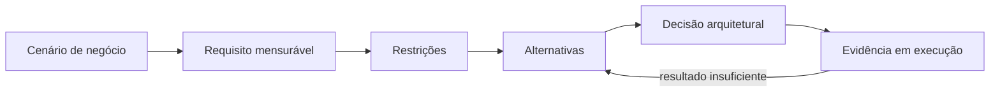

# Aula 01: Arquitetura e requisitos de qualidade

Implementar as funções de um sistema é apenas parte do problema. Arquitetura
começa quando precisamos garantir que essas funções continuem corretas sob
carga, falhas, ataques, mudanças e restrições reais de custo e prazo.

## Material original

<iframe
  class="pdf-preview"
  src="../../assets/pdfs/2026-2/aula-01-introducao.pdf"
  title="Visualização do PDF da Aula 01: Introdução">
</iframe>

[Abrir ou baixar o PDF](../assets/pdfs/2026-2/aula-01-introducao.pdf){ .md-button .md-button--primary }

37 páginas. O visualizador usa o leitor de PDF do navegador.

## Objetivos

- Diferenciar requisitos funcionais de requisitos de qualidade.
- Entender arquitetura como decisão estrutural sob restrições.
- Reconhecer confiabilidade, escalabilidade, segurança e manutenibilidade.
- Relacionar uma decisão à evidência usada para avaliá-la.
- Entender o papel humano na decisão mesmo com o apoio de IA.

## O CRUD é necessário, mas não diferencia o sistema

Muitas aplicações oferecem as mesmas operações de criar, consultar, atualizar e
excluir dados. Um e-commerce, um banco e um sistema acadêmico podem ser descritos
como conjuntos de CRUDs, mas operam sob riscos muito diferentes.

No e-commerce usado ao longo das aulas, o checkout precisa calcular o total,
registrar o pedido e iniciar o pagamento. Além de executar essas funções, deve
evitar cobranças duplicadas, responder durante picos, proteger dados pessoais e
permitir que novas regras sejam adicionadas com segurança.

| Tipo de requisito | Pergunta principal | Exemplo no e-commerce |
|---|---|---|
| Funcional | O que o sistema faz? | Finalizar uma compra |
| Qualidade | Como e sob quais condições ele faz? | Processar uma tentativa repetida sem cobrar duas vezes |

“O sistema será rápido” não permite verificar o resultado. “95% dos checkouts
responderão em até 800 ms com 300 usuários simultâneos” oferece cenário, métrica
e limite para orientar e avaliar uma decisão.

## Arquitetura como sequência de decisões

Uma definição operacional para a disciplina é:

> Arquitetura de software é tomar decisões estruturais para que um sistema atenda
> seus requisitos de qualidade dentro das restrições existentes.

Uma decisão é arquitetural quando alterá-la depois custa caro ou afeta muitas
partes. Limites entre módulos, estratégia de persistência e forma de comunicação
costumam ter esse peso. Um detalhe local de implementação normalmente não tem.

## Requisitos que guiam o curso

| Requisito | Pergunta aplicada ao e-commerce | Evidência possível |
|---|---|---|
| Confiabilidade | O pedido termina no estado correto diante de falhas? | Taxa de sucesso e pedidos inconsistentes |
| Escalabilidade | O checkout suporta um pico de compras? | Latência e vazão sob carga |
| Segurança | Apenas pessoas autorizadas acessam dados e operações? | Eventos de auditoria e testes de autorização |
| Manutenibilidade | Uma regra nova exige mudanças localizadas? | Arquivos alterados, tempo e falhas por mudança |

Observabilidade, usabilidade, rastreabilidade e custo atravessam esses requisitos.
Uma fila pode absorver picos e melhorar resiliência, mas adiciona processamento
assíncrono e torna o rastreamento mais difícil. Uma solução tecnicamente adequada
ainda pode ser inviável por custo ou conhecimento da equipe.

## Não existe solução perfeita

Requisitos de qualidade disputam recursos e introduzem consequências. Essa troca
é o *trade-off*. Antes de escolher uma tecnologia, a equipe precisa conhecer:

1. o cenário que deve melhorar;
2. a métrica e o limite esperados;
3. as restrições de prazo, custo, equipe e tecnologia;
4. as alternativas viáveis;
5. os custos e novos riscos de cada alternativa;
6. como observar o resultado e revisar a escolha.

Pular diretamente do problema para uma ferramenta impede saber se ela resolve o
problema certo. Cache, fila, container e padrão de projeto são mecanismos, não
objetivos arquiteturais.

## IA como apoio à engenharia

IA pode acelerar implementação, exploração de alternativas e produção de
testes. Ela não conhece automaticamente as restrições do negócio, os riscos
aceitos nem a capacidade operacional da equipe. Toda sugestão ainda precisa ser
confrontada com evidências, custos e consequências.

## Continue pelas subaulas

| Se você precisa... | Continue em... |
|---|---|
| Transformar uma preocupação vaga em um requisito verificável | 01.1: Requisitos de qualidade |
| Comparar alternativas e justificar uma escolha | 01.2: Decisões e *trade-offs* |

-   :material-gauge:{ .lg .middle } **01.1: Requisitos de qualidade**

    Especifique cenários mensuráveis para checkout, catálogo e pagamento.

    [Estudar requisitos de qualidade](aula-01-requisitos-qualidade.md)

-   :material-sign-direction:{ .lg .middle } **01.2: Decisões e trade-offs**

    Compare alternativas e registre decisões com suas consequências.

    [Estudar decisões arquiteturais](aula-01-decisoes-arquiteturais.md)

## Trilha da disciplina

O e-commerce evolui durante o curso: primeiro definimos o que precisa ser
garantido; depois organizamos o design, empacotamos e implantamos a aplicação e,
por fim, observamos sua confiabilidade em execução.
