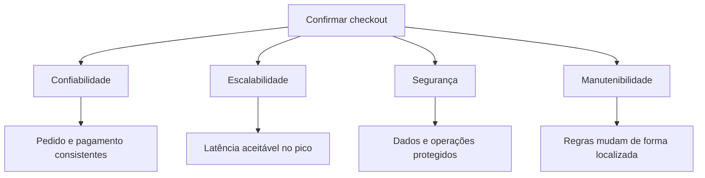

# Aula 01.1: Requisitos de qualidade

[Voltar para a Aula 01](aula-01-introducao.md)

Um requisito de qualidade descreve como o sistema deve se comportar em uma
situação relevante e qual resultado será considerado aceitável. Nesta subaula,
o e-commerce transforma preocupações vagas em cenários verificáveis.

## Objetivos

- Distinguir função, qualidade e restrição.
- Escrever cenários com contexto, estímulo, resposta e medida.
- Relacionar requisitos a sinais observáveis.
- Identificar conflitos entre requisitos.

## O problema das palavras vagas

### Antes: intenção sem critério

> O checkout deve ser rápido, seguro e sempre disponível.

A frase comunica uma preocupação legítima, mas não informa carga, condição de
falha, operação protegida nem limite aceitável. Duas equipes podem implementar
soluções diferentes e ambas declarar que atenderam ao texto.

### Depois: cenários verificáveis

| Elemento | Pergunta | Exemplo |
|---|---|---|
| Fonte | Quem ou o que produz o estímulo? | Cliente autenticado |
| Estímulo | O que acontece? | Envia a confirmação do checkout |
| Ambiente | Em qual condição? | Pico com 300 usuários simultâneos |
| Artefato | Qual parte é afetada? | API de pedidos |
| Resposta | O que o sistema deve fazer? | Criar um único pedido e responder |
| Medida | Qual limite define sucesso? | 95% em até 800 ms e nenhuma duplicação |

O requisito passa a orientar design, testes e monitoramento. O número não precisa
ser perfeito na primeira versão, mas deve representar uma hipótese explícita que
possa ser revisada com dados.

## Um e-commerce, quatro perspectivas

### Confiabilidade

Confiabilidade é produzir o resultado correto de maneira consistente. Para o
checkout, disponibilidade da API não basta: responder `200` e cobrar duas vezes
é uma falha grave.

| Cenário | Resposta esperada | Medida |
|---|---|---|
| Cliente repete a requisição após perder a conexão | Reutilizar o resultado da primeira tentativa | Nenhuma cobrança duplicada |
| Transportadora fica indisponível | Encerrar a espera e informar uma resposta conhecida | *Timeout* em até 2 s |
| Banco reinicia durante a criação | Não deixar pedido parcialmente persistido | Zero pedidos sem estado válido |

### Escalabilidade

Escalabilidade é manter o serviço aceitável quando carga ou volume variam. A
primeira pergunta não é “qual tecnologia usar?”, mas “qual recurso ou meta deixa
de atender ao cenário?”.

| Cenário | Resposta esperada | Medida |
|---|---|---|
| Campanha dobra acessos ao catálogo | Continuar respondendo sem sobrecarregar o banco | 95% das consultas em até 300 ms |
| Pico de confirmações de pedido | Absorver a variação sem perder pedidos | 50 pedidos/s e nenhuma perda |

Cache pode reduzir latência, mas introduz invalidação e dados desatualizados.
Fila pode absorver picos, mas altera o tempo de resposta e adiciona operação.

### Segurança

Segurança inclui autenticação, autorização, confidencialidade, integridade,
auditoria e privacidade.

| Cenário | Resposta esperada | Medida |
|---|---|---|
| Cliente tenta consultar pedido de outra conta | Negar sem revelar os dados | 100% dos testes de autorização aprovados |
| Operação relevante é executada | Registrar identidade, ação e resultado | Evento de auditoria para toda alteração de estado |
| Falha inesperada ocorre | Responder sem segredo ou dado pessoal | Nenhum dado sensível em resposta ou log |

### Manutenibilidade

Manutenibilidade aparece no esforço para entender, modificar, testar e corrigir.
Ela é aprofundada na [Aula 02](aula-02-manutenibilidade.md).

Um cenário possível é: ao adicionar uma política de desconto, a equipe deve
alterar somente o ponto de extensão da política e seus testes, sem modificar
persistência ou integração com pagamento.

## Requisitos interagem

Uma decisão raramente melhora apenas uma propriedade.

| Decisão | Benefício | Consequência que precisa ser controlada |
|---|---|---|
| Adicionar cache ao catálogo | Menor latência | Produto ou preço desatualizado |
| Repetir chamada de pagamento | Recuperação de falha transitória | Cobrança duplicada sem idempotência |
| Registrar corpo completo da requisição | Diagnóstico mais fácil | Exposição de dado pessoal |
| Dividir uma classe em componentes | Mudanças mais localizadas | Mais contratos e navegação no código |

!!! warning "Não transforme a métrica em objetivo isolado"
    Uma equipe pode reduzir latência servindo informação incorreta ou aumentar
    cobertura com testes que não detectam falhas relevantes. A medida só faz
    sentido junto com o cenário e o resultado para o usuário.

## Checklist de um requisito útil

- O cenário representa um risco real do negócio?
- A resposta esperada é observável?
- Existe uma métrica com unidade e limite?
- O ambiente de medição está descrito?
- As restrições e dependências são conhecidas?
- Há outro requisito que pode piorar com essa decisão?

## Próximo passo

Com os requisitos mensuráveis, compare alternativas e registre as consequências
na [Aula 01.2: Decisões e trade-offs](aula-01-decisoes-arquiteturais.md).
