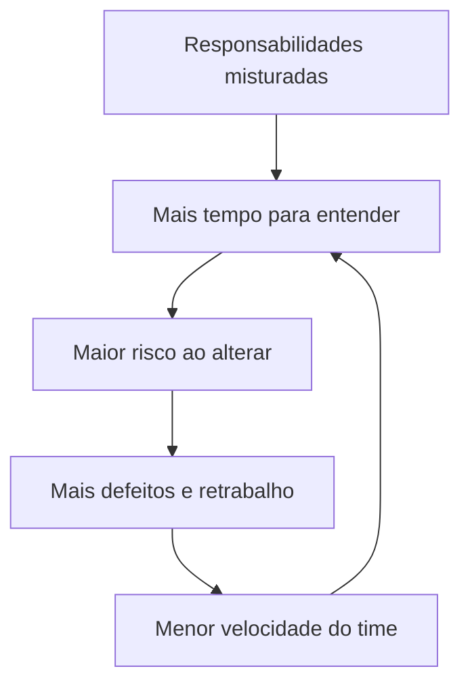

# Aula 02: Manutenibilidade e SOLID

Manutenibilidade aparece no esforço necessário para entender, modificar, testar
e corrigir um sistema. O objetivo não é produzir código bonito de forma abstrata,
mas tornar as próximas mudanças previsíveis, seguras e baratas.

## Material original

<iframe
  class="pdf-preview"
  src="../../assets/pdfs/2026-2/aula-02-manutenibilidade.pdf"
  title="Visualização do PDF da Aula 02: Manutenibilidade">
</iframe>

[Abrir ou baixar o PDF](../assets/pdfs/2026-2/aula-02-manutenibilidade.pdf){ .md-button .md-button--primary }

18 páginas. O visualizador usa o leitor de PDF do navegador.

## Objetivos

- Relacionar manutenibilidade ao custo e ao risco de mudança.
- Identificar acoplamento, coesão, duplicação e complexidade.
- Interpretar métricas sem transformá-las em objetivos isolados.
- Usar SOLID para analisar responsabilidades e dependências.
- Escolher um padrão a partir do problema, não do nome da solução.

## O que significa manter um sistema?

Uma mudança pequena expõe a qualidade do design. Se alterar uma regra exige abrir
muitos arquivos, conhecer detalhes internos e repetir testes manuais, o sistema
tem baixa manutenibilidade.

O material divide o trabalho de manutenção em quatro capacidades:

| Capacidade | Resultado esperado |
|---|---|
| Entender | Encontrar onde uma regra ou comportamento está implementado |
| Modificar | Fazer a mudança sem espalhar alterações pelo sistema |
| Testar | Validar o novo comportamento com baixo esforço |
| Corrigir | Diagnosticar e resolver defeitos sem efeitos em cascata |

Essas capacidades se reforçam. Responsabilidades claras facilitam a localização
da regra; dependências explícitas permitem isolar o comportamento; testes rápidos
reduzem a incerteza da alteração.

## Por que o custo de mudança aumenta?

Quatro problemas aparecem com frequência:

- **acoplamento alto:** uma parte conhece detalhes demais de outras partes;
- **complexidade alta:** há caminhos e estados demais para compreender e testar;
- **duplicação:** a mesma regra precisa ser alterada em vários lugares;
- **dependências frágeis:** detalhes externos vazam para o núcleo da aplicação.

Uma entrega lenta nem sempre indica falta de esforço. Pode indicar que cada
alteração exige pagar juros de decisões anteriores.

## Propriedades desejáveis no design

### Baixo acoplamento e alta coesão

Acoplamento mede o quanto módulos dependem uns dos outros. Coesão indica o quanto
as responsabilidades de um módulo pertencem ao mesmo propósito. O objetivo é
reduzir conhecimento entre partes e manter juntas as regras que mudam pelo mesmo
motivo.

Baixo acoplamento não significa ausência de dependências. Uma aplicação precisa
colaborar com banco, mensageria e serviços externos. A diferença é tornar essas
relações pequenas, explícitas e substituíveis.

### Responsabilidades claras

Um módulo deve ter um propósito que possa ser explicado sem uma lista de funções
desconexas. Uma classe que calcula preço, persiste pedido, envia e-mail e gera
nota fiscal mistura regras com motivos de mudança distintos.

Separar `PricingService`, `OrderRepository` e `NotificationService` não é apenas
organização. Cada mudança passa a ter um destino mais previsível e testes mais
focados.

### Testabilidade e mudanças localizadas

Um comportamento testável recebe suas dependências e expõe um resultado
observável. Se uma regra só pode ser verificada com banco, rede e interface em
execução, o retorno de cada alteração fica lento e frágil.

Uma mudança localizada afeta poucas partes. Isso reduz o raio de impacto, melhora
a revisão de código e simplifica a reversão quando algo falha.

## Como medir manutenibilidade

Nenhuma métrica responde sozinha se um sistema é manutenível. O valor está em
combinar sinais técnicos e sinais do processo.

| Dimensão | Exemplos | Pergunta que ajuda a responder |
|---|---|---|
| Complexidade | Ciclomática e cognitiva | Quantos caminhos ou conceitos precisam ser acompanhados? |
| Estrutura | Acoplamento, coesão e ciclos | A mudança atravessa muitos módulos? |
| Código | Duplicação, tamanho e *code smells* | Há indícios de responsabilidade difusa? |
| Fluxo | *Lead time* e frequência de entrega | Quanto tempo uma mudança leva até chegar ao usuário? |
| Estabilidade | Defeitos e *change failure rate* | Quantas mudanças causam falha ou retrabalho? |

Métricas podem ser manipuladas quando viram metas. Reduzir o tamanho médio de
classes, por exemplo, pode gerar muitas classes pequenas sem melhorar o design.
Use a tendência e o contexto para investigar, não para substituir julgamento.

## SOLID como ferramenta de raciocínio

SOLID reúne cinco princípios para pensar mudança, responsabilidade e dependência.
Eles não são uma certificação de qualidade nem exigem uma classe para cada linha.

### S: Single Responsibility Principle

Uma classe ou módulo deve possuir uma responsabilidade coesa e um conjunto
coerente de motivos para mudar. A pergunta prática é: quantas razões diferentes
podem exigir alteração aqui?

Se `OrderService` calcula preço, salva no banco e envia e-mail, mudanças de regra
comercial, persistência e comunicação competem no mesmo lugar.

### O: Open/Closed Principle

O design deve permitir extensão sem transformar cada comportamento novo em uma
alteração espalhada. “Fechado para modificação” não significa nunca tocar no
código. Significa criar um ponto estável de extensão quando existe variação real.

### L: Liskov Substitution Principle

Uma implementação substituta deve preservar o contrato esperado. Se uma subclasse
exige tratamento especial, rejeita operações válidas do tipo base ou muda o
significado da resposta, a abstração é enganosa.

O contrato inclui assinatura, condições de entrada, resultado, erros e efeitos
observáveis.

### I: Interface Segregation Principle

Um consumidor deve depender apenas das operações que usa. Interfaces grandes
obrigam implementações a criar métodos vazios, lançar exceções inesperadas ou
conhecer capacidades irrelevantes.

Interfaces menores devem refletir papéis do domínio, não uma divisão mecânica de
cada método em um arquivo.

### D: Dependency Inversion Principle

Regras centrais devem depender de abstrações estáveis. Banco de dados, cliente
HTTP e mensageria são detalhes que implementam contratos definidos pelo caso de
uso.

Injeção de dependência é um mecanismo comum para montar essas relações. Ela ajuda
a aplicar o princípio, mas usar um framework de injeção não garante um bom limite
arquitetural.

## Do problema ao padrão

Um padrão só é útil quando reduz um custo de mudança conhecido. O caminho começa
no sintoma, passa pelo princípio de design e termina em uma consequência que pode
ser observada.

| Se o problema é... | Princípio relacionado | Estude primeiro |
|---|---|---|
| Condicionais crescem com cada nova regra | OCP e SRP | Strategy e Factory |
| Domínio conhece banco e detalhes de construção | DIP e SRP | Repository e Injeção de Dependência |
| API externa contamina o modelo interno | DIP | Adapter |
| Métricas ou logs alteram a classe principal | OCP e SRP | Decorator |
| Uma ação precisa avisar vários interessados | OCP | Observer e Listener |
| Um objeto complexo possui muitas combinações | SRP | Builder |
| Itens individuais e grupos têm o mesmo comportamento | LSP | Composite |

## Continue pelas subaulas

-   :material-source-branch:{ .lg .middle } **02.1: Padrões fundamentais**

    Strategy, Factory, Repository e Injeção de Dependência aplicados ao checkout
    e à persistência de pedidos.

    [Estudar padrões fundamentais](aula-02-padroes-fundamentais.md)

-   :material-puzzle-outline:{ .lg .middle } **02.2: Padrões complementares**

    Adapter, Decorator, Observer, Builder e Composite aplicados a integrações,
    eventos e composição do catálogo.

    [Estudar padrões complementares](aula-02-padroes-complementares.md)

!!! warning "Padrões não são regras universais"
    Um padrão é útil quando nomeia e resolve um problema recorrente. Aplicá-lo
    antes de existir variação, dependência ou complexidade pode apenas adicionar
    arquivos e indireções.
