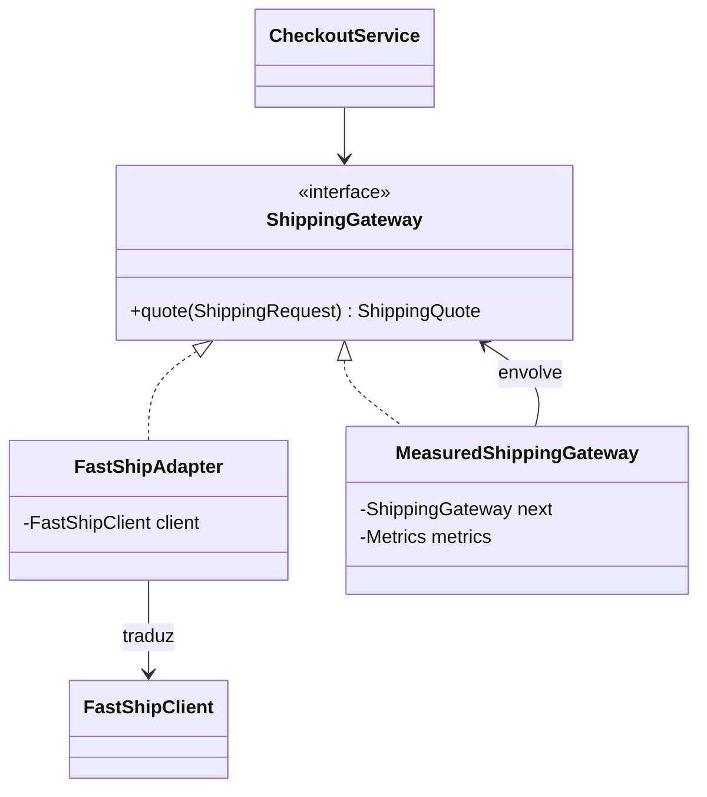
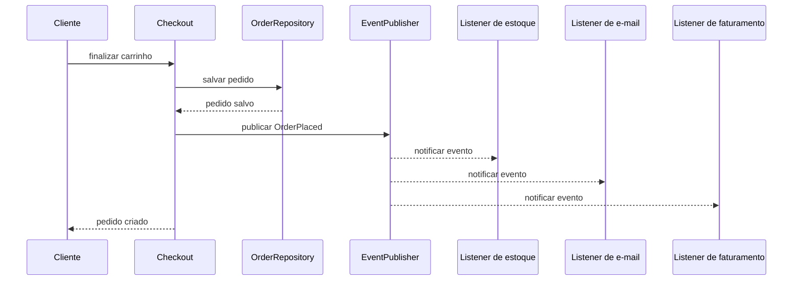
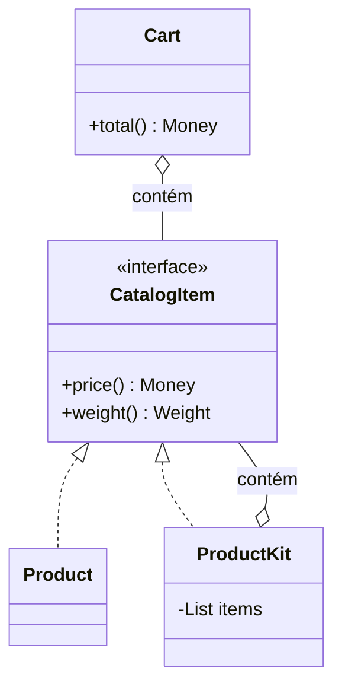

# Subaula 02.2: Padrões complementares

[Voltar para Manutenibilidade e SOLID](aula-02-manutenibilidade.md){ .md-button }
[Revisar padrões fundamentais](aula-02-padroes-fundamentais.md){ .md-button }

O e-commerce agora precisa conversar com uma transportadora, medir integrações,
reagir à criação de pedidos e representar produtos compostos. Adapter, Decorator,
Observer, Builder e Composite ajudam quando essas necessidades começam a se
espalhar pelo código.

## Objetivos

- Proteger o domínio de contratos externos com Adapter.
- Acrescentar comportamento ao redor de um serviço com Decorator.
- Distribuir eventos para vários interessados com Observer e Listener.
- Construir objetos complexos de forma legível com Builder.
- Tratar itens individuais e grupos por um contrato comum com Composite.

## Adapter e Decorator

O checkout consulta uma transportadora externa. A biblioteca recebida trabalha
com centavos, códigos próprios e uma resposta que não pertence ao vocabulário do
e-commerce.

### Antes: o contrato externo invade o checkout

```java
public final class CheckoutService {
    private final FastShipClient fastShip;

    public Money shippingFor(Order order) {
        FastShipResponse response = fastShip.quote(
            order.zipCode().replace("-", ""),
            order.totalWeightInGrams()
        );

        if (!response.statusCode().equals("OK")) {
            throw new ShippingUnavailableException(response.message());
        }

        return Money.fromCents(response.priceInCents());
    }
}
```

O caso de uso conhece nomes, unidades e códigos da transportadora. Trocar o
fornecedor ou testar uma cotação exige reproduzir o contrato externo.

### Depois: Adapter traduz para o contrato interno

O e-commerce define o que precisa:

```java
public interface ShippingGateway {
    ShippingQuote quote(ShippingRequest request);
}
```

O Adapter concentra a tradução:

```java
public final class FastShipAdapter implements ShippingGateway {
    private final FastShipClient client;

    public FastShipAdapter(FastShipClient client) {
        this.client = client;
    }

    @Override
    public ShippingQuote quote(ShippingRequest request) {
        var response = client.quote(
            request.destination().digitsOnly(),
            request.weight().inGrams()
        );

        if (!response.statusCode().equals("OK")) {
            throw new ShippingUnavailableException(response.message());
        }

        return new ShippingQuote(
            Money.fromCents(response.priceInCents()),
            Duration.ofDays(response.deliveryDays())
        );
    }
}
```

O restante da aplicação passa a falar em `ShippingRequest`, `ShippingQuote`,
`Money` e `Duration`. Detalhes da FastShip ficam na borda.

### Decorator: métricas sem alterar o Adapter

Depois da integração, a equipe precisa medir latência e falhas. Alterar cada
Adapter para incluir métricas duplicaria uma responsabilidade operacional.

```java
public final class MeasuredShippingGateway implements ShippingGateway {
    private final ShippingGateway next;
    private final Metrics metrics;

    public MeasuredShippingGateway(ShippingGateway next, Metrics metrics) {
        this.next = next;
        this.metrics = metrics;
    }

    @Override
    public ShippingQuote quote(ShippingRequest request) {
        long startedAt = System.nanoTime();

        try {
            return next.quote(request);
        } catch (RuntimeException error) {
            metrics.increment("shipping.quote.error");
            throw error;
        } finally {
            metrics.recordDuration(
                "shipping.quote.duration",
                System.nanoTime() - startedAt
            );
        }
    }
}
```

Na composição da aplicação, o Decorator envolve o Adapter:

```java
ShippingGateway shipping = new MeasuredShippingGateway(
    new FastShipAdapter(new FastShipClient(configuration)),
    metrics
);
```



!!! success "Quando usar"
    Use Adapter quando o contrato de uma biblioteca ou API não combina com o
    modelo interno. Use Decorator quando métricas, cache, autorização ou outra
    responsabilidade transversal precisa envolver um contrato sem alterar sua
    implementação principal.

!!! caution "Quando não usar"
    Não crie Adapter que apenas repassa os mesmos métodos e tipos. Não empilhe
    Decorators quando a ordem entre eles é difícil de explicar ou muda o resultado
    de forma implícita.

!!! info "Custo introduzido"
    A execução ganha camadas. Logs e depuração precisam mostrar qual Adapter e
    quais Decorators participaram da chamada.

## Observer e Listener

Quando um pedido é criado, estoque, e-mail e faturamento precisam reagir. O
checkout não deveria conhecer a implementação de todos esses processos.

### Antes: o caso de uso chama todos os interessados

```java
public Order finish(Cart cart) {
    Order order = createOrder(cart);
    orders.save(order);

    stock.reserve(order.items());
    email.sendConfirmation(order.customerEmail());
    invoicing.issueInvoice(order.id());

    return order;
}
```

Cada nova reação altera o checkout. Uma falha de e-mail também pode impedir a
conclusão do pedido, mesmo quando a regra do negócio permitir envio posterior.

### Depois: o caso de uso publica um evento

```java
public record OrderPlaced(
    UUID orderId,
    String customerEmail,
    List<OrderItem> items
) {}
```

```java
public Order finish(Cart cart) {
    Order order = createOrder(cart);
    orders.save(order);
    events.publish(new OrderPlaced(
        order.id(),
        order.customerEmail(),
        order.items()
    ));
    return order;
}
```

Cada Listener assume uma reação:

```java
public final class ReserveStockOnOrderPlaced {
    private final StockService stock;

    public void handle(OrderPlaced event) {
        stock.reserve(event.items());
    }
}

public final class SendConfirmationOnOrderPlaced {
    private final EmailService email;

    public void handle(OrderPlaced event) {
        email.sendConfirmation(event.customerEmail());
    }
}
```



Observer define a relação entre quem publica e quem observa. Listener é o objeto
que reage a um evento específico. A execução pode ser síncrona ou assíncrona;
essa escolha altera consistência, tratamento de falhas e observabilidade.

!!! success "Quando usar"
    Use eventos quando vários interessados reagem a um fato concluído e quando o
    publicador não deve conhecer cada reação. Dê ao evento um nome no passado,
    como `OrderPlaced`, para comunicar que algo já aconteceu.

!!! caution "Quando não usar"
    Não use evento para esconder uma chamada obrigatória cuja falha deve cancelar
    a transação. Um fluxo com apenas um consumidor direto pode ser mais claro como
    uma chamada explícita.

!!! info "Custo introduzido"
    O fluxo deixa de estar visível em um único método. Em execução assíncrona,
    entram repetição, idempotência, ordem, falhas parciais e monitoramento da fila.

## Builder

Um pedido possui cliente, itens, endereço, entrega, cupom e observações. Um
construtor longo não comunica qual argumento ocupa cada posição.

### Antes: construtor posicional

```java
Order order = new Order(
    orderId,
    customerId,
    items,
    billingAddress,
    shippingAddress,
    DeliveryType.EXPRESS,
    "WELCOME10",
    null,
    true
);
```

Dois endereços do mesmo tipo podem ser invertidos sem erro de compilação. Valores
opcionais aparecem como `null`, e o significado de `true` depende da assinatura.

### Depois: construção nomeada e validada

```java
Order order = Order.builder()
    .id(orderId)
    .customer(customerId)
    .items(items)
    .billingAddress(billingAddress)
    .shippingAddress(shippingAddress)
    .delivery(DeliveryType.EXPRESS)
    .coupon("WELCOME10")
    .giftWrap(true)
    .build();
```

```java
public final class OrderBuilder {
    private UUID id;
    private CustomerId customer;
    private List<OrderItem> items = new ArrayList<>();
    private Address shippingAddress;
    private DeliveryType delivery = DeliveryType.STANDARD;

    public OrderBuilder id(UUID id) {
        this.id = id;
        return this;
    }

    public OrderBuilder customer(CustomerId customer) {
        this.customer = customer;
        return this;
    }

    public OrderBuilder addItem(OrderItem item) {
        this.items.add(item);
        return this;
    }

    public Order build() {
        requireNonNull(id, "id");
        requireNonNull(customer, "customer");
        requireNonNull(shippingAddress, "shippingAddress");

        if (items.isEmpty()) {
            throw new IllegalStateException("order requires at least one item");
        }

        return new Order(id, customer, items, shippingAddress, delivery);
    }
}
```

O método `build` concentra invariantes de construção. O objeto final ainda deve
proteger seu próprio estado depois de criado.

!!! success "Quando usar"
    Use Builder quando há muitos parâmetros, várias opções ou etapas de validação
    antes de criar um objeto válido.

!!! caution "Quando não usar"
    Um objeto pequeno com dois ou três campos obrigatórios costuma ser mais claro
    com um construtor ou método de fábrica nomeado.

!!! info "Custo introduzido"
    Builder duplica parte da estrutura do objeto e pode aceitar estados
    intermediários inválidos. A validação em `build` não pode ser esquecida.

## Composite

O catálogo vende produtos individuais e kits. Ambos podem entrar no carrinho e
precisam informar preço e peso.

### Antes: tratamento especial para cada tipo

```java
public Money total(List<Product> products, List<ProductKit> kits) {
    Money total = Money.zero();

    for (Product product : products) {
        total = total.add(product.price());
    }

    for (ProductKit kit : kits) {
        for (Product product : kit.products()) {
            total = total.add(product.price());
        }
    }

    return total;
}
```

O carrinho precisa saber como um kit é formado. Se kits puderem conter outros
kits, a lógica especial cresce novamente.

### Depois: individuais e grupos compartilham o contrato

```java
public interface CatalogItem {
    Money price();
    Weight weight();
}

public final class Product implements CatalogItem {
    private final Money price;
    private final Weight weight;

    @Override
    public Money price() {
        return price;
    }

    @Override
    public Weight weight() {
        return weight;
    }
}
```

```java
public final class ProductKit implements CatalogItem {
    private final List<CatalogItem> items;

    @Override
    public Money price() {
        return items.stream()
            .map(CatalogItem::price)
            .reduce(Money.zero(), Money::add);
    }

    @Override
    public Weight weight() {
        return items.stream()
            .map(CatalogItem::weight)
            .reduce(Weight.zero(), Weight::add);
    }
}
```

O carrinho trabalha somente com `CatalogItem`:

```java
public Money total(List<CatalogItem> items) {
    return items.stream()
        .map(CatalogItem::price)
        .reduce(Money.zero(), Money::add);
}
```



Composite permite tratar folha e composição pelo mesmo contrato. `Product` é a
folha; `ProductKit` é a composição que delega ou agrega o resultado de seus itens.

!!! success "Quando usar"
    Use Composite quando existe uma estrutura parte-todo e clientes precisam
    tratar elementos individuais e grupos da mesma forma.

!!! caution "Quando não usar"
    Não force um contrato comum se grupos e elementos possuem regras incompatíveis.
    Uma hierarquia artificial pode violar substituição e esconder operações que só
    fazem sentido para a composição.

!!! info "Custo introduzido"
    Estruturas recursivas exigem cuidado com ciclos, profundidade e custo de
    percorrer a árvore.

## Mapa de escolha

| Necessidade no e-commerce | Padrão | Resultado esperado |
|---|---|---|
| Traduzir a transportadora | Adapter | Contrato externo isolado na borda |
| Medir a cotação sem alterá-la | Decorator | Comportamento transversal combinável |
| Avisar vários processos | Observer e Listener | Publicador desacoplado das reações |
| Construir um pedido complexo | Builder | Criação legível e validada |
| Tratar produto e kit igualmente | Composite | Operação uniforme em uma hierarquia |

Nenhum padrão elimina complexidade. Ele desloca a complexidade para uma estrutura
conhecida, com responsabilidades e custos mais explícitos.

## Encerramento do módulo

Volte à [Aula 02](aula-02-manutenibilidade.md) e compare cada padrão com o problema
que o motivou. A decisão deve ser explicada pelo custo de mudança que foi reduzido,
não pela quantidade de padrões presentes no código.

[Voltar para padrões fundamentais](aula-02-padroes-fundamentais.md){ .md-button }
[Voltar para Manutenibilidade e SOLID](aula-02-manutenibilidade.md){ .md-button .md-button--primary }
