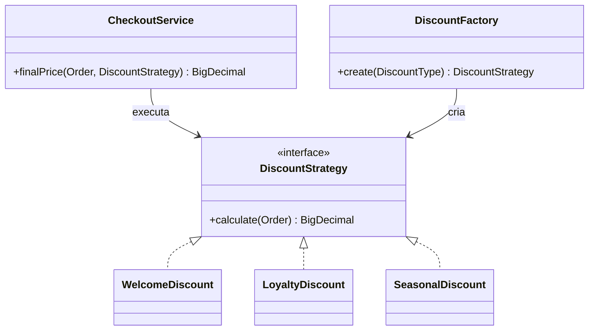
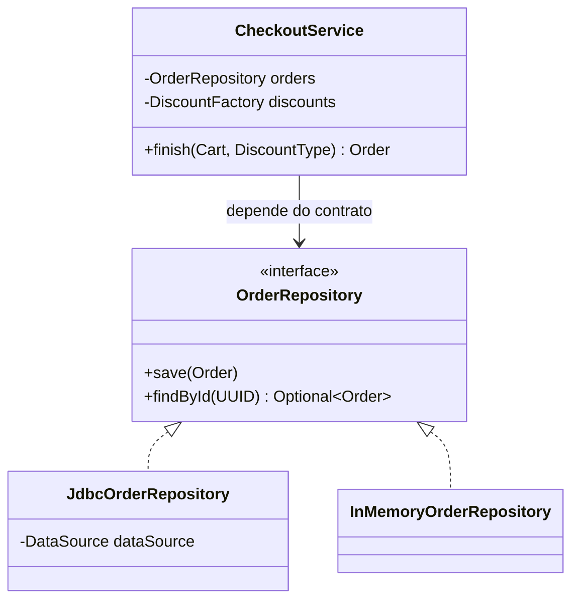
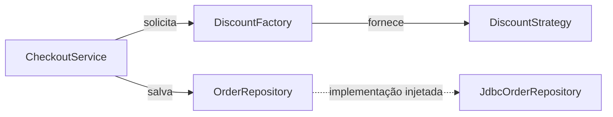

# Subaula 02.1: Padrões fundamentais

[Voltar para Manutenibilidade e SOLID](aula-02-manutenibilidade.md){ .md-button }

Esta subaula evolui o checkout de um e-commerce. O código começa com regras,
criação de objetos e persistência concentradas em um único serviço. Strategy,
Factory, Repository e Injeção de Dependência são introduzidos somente quando essa
estrutura passa a dificultar mudanças.

## Objetivos

- Separar comportamentos que variam com Strategy.
- Concentrar a criação de implementações com Factory.
- Isolar persistência por meio de Repository.
- Tornar dependências explícitas com Injeção de Dependência.
- Relacionar os padrões a SRP, OCP e DIP.

## O cenário do e-commerce

O checkout precisa calcular descontos e registrar o pedido. No início há apenas
três políticas comerciais:

- cliente novo recebe desconto de boas-vindas;
- cliente recorrente recebe desconto de fidelidade;
- campanha sazonal aplica uma porcentagem configurada.

O primeiro código funciona. O problema aparece quando novas políticas são
adicionadas, regras existentes mudam e a persistência precisa ser testada sem um
banco real.

## Strategy e Factory

Strategy representa comportamentos intercambiáveis por um contrato comum.
Factory concentra a escolha ou a construção das implementações concretas.

### Antes: seleção e cálculo no mesmo método

```java
public BigDecimal calculateDiscount(Order order, DiscountType type) {
    if (type == DiscountType.WELCOME) {
        return order.total().multiply(new BigDecimal("0.10"));
    }

    if (type == DiscountType.LOYALTY) {
        return order.total().multiply(new BigDecimal("0.15"));
    }

    if (type == DiscountType.SEASONAL) {
        return order.total().multiply(new BigDecimal("0.20"));
    }

    return BigDecimal.ZERO;
}
```

O método conhece todas as políticas. Adicionar uma campanha exige alterar a
mesma sequência de condicionais. Seleção e execução mudam por motivos diferentes,
mas estão no mesmo lugar.

### Depois: cada política implementa um contrato

```java
public interface DiscountStrategy {
    BigDecimal calculate(Order order);
}

public final class WelcomeDiscount implements DiscountStrategy {
    @Override
    public BigDecimal calculate(Order order) {
        return order.total().multiply(new BigDecimal("0.10"));
    }
}

public final class LoyaltyDiscount implements DiscountStrategy {
    @Override
    public BigDecimal calculate(Order order) {
        return order.total().multiply(new BigDecimal("0.15"));
    }
}
```

O checkout recebe uma estratégia e apenas executa o contrato:

```java
public final class CheckoutService {
    public BigDecimal finalPrice(Order order, DiscountStrategy discount) {
        return order.total().subtract(discount.calculate(order));
    }
}
```

Cada política pode mudar sem alterar o checkout. Uma implementação substituta
precisa respeitar o mesmo contrato: receber o pedido e devolver um desconto
válido.

### Factory: escolha em um único ponto

Se a política chega como um valor de entrada, alguma parte precisa convertê-la em
uma estratégia. A Factory concentra essa decisão:

```java
public final class DiscountFactory {
    public DiscountStrategy create(DiscountType type) {
        return switch (type) {
            case WELCOME -> new WelcomeDiscount();
            case LOYALTY -> new LoyaltyDiscount();
            case SEASONAL -> new SeasonalDiscount(new BigDecimal("0.20"));
        };
    }
}
```



Factory não substitui Strategy. Strategy organiza os comportamentos; Factory
organiza a criação ou seleção desses comportamentos.

### Relação com SOLID

| Princípio | Efeito no exemplo |
|---|---|
| SRP | Checkout calcula o preço; cada estratégia calcula seu desconto; Factory escolhe a implementação |
| OCP | Uma nova política entra como outra implementação do contrato |
| LSP | Qualquer estratégia válida pode substituir outra sem mudar o checkout |
| DIP | Checkout depende de `DiscountStrategy`, não de descontos concretos |

!!! success "Quando usar"
    Use Strategy quando existe uma família real de comportamentos, quando eles
    crescem ou quando precisam ser selecionados em execução. Use Factory quando a
    construção ou seleção está se espalhando por vários consumidores.

!!! caution "Quando não usar"
    Duas condições pequenas, estáveis e locais podem continuar como condicionais.
    Criar interface, três classes e uma Factory sem perspectiva de variação apenas
    aumenta o caminho de leitura.

!!! info "Custo introduzido"
    O design ganha mais tipos e indireções. Para entender uma execução, a pessoa
    precisa localizar a Factory e a estratégia escolhida.

## Repository e Injeção de Dependência

Repository define um contrato de persistência na linguagem da aplicação.
Injeção de Dependência fornece a implementação de que um objeto precisa, em vez
de permitir que ele próprio construa essa dependência.

### Antes: regra e banco no mesmo serviço

```java
public final class CheckoutService {
    public void finish(Order order) throws SQLException {
        var connection = DriverManager.getConnection(
            "jdbc:postgresql://database/shop",
            "application",
            System.getenv("DATABASE_PASSWORD")
        );

        var statement = connection.prepareStatement(
            "insert into orders (id, total) values (?, ?)"
        );
        statement.setObject(1, order.id());
        statement.setBigDecimal(2, order.total());
        statement.executeUpdate();
    }
}
```

O caso de uso conhece JDBC, endereço do banco, SQL e credenciais. Uma mudança de
persistência afeta o checkout. Testar o fluxo exige infraestrutura real ou
simulação de detalhes de JDBC.

### Depois: o domínio define o contrato

```java
public interface OrderRepository {
    void save(Order order);
    Optional<Order> findById(UUID orderId);
}
```

O serviço recebe o contrato pelo construtor:

```java
public final class CheckoutService {
    private final OrderRepository orders;
    private final DiscountFactory discounts;

    public CheckoutService(
        OrderRepository orders,
        DiscountFactory discounts
    ) {
        this.orders = orders;
        this.discounts = discounts;
    }

    public Order finish(Cart cart, DiscountType discountType) {
        var order = Order.from(cart);
        var discount = discounts.create(discountType);
        order.applyDiscount(discount.calculate(order));
        orders.save(order);
        return order;
    }
}
```

A infraestrutura implementa o contrato em outro módulo:

```java
public final class JdbcOrderRepository implements OrderRepository {
    private final DataSource dataSource;

    public JdbcOrderRepository(DataSource dataSource) {
        this.dataSource = dataSource;
    }

    @Override
    public void save(Order order) {
        // SQL e tratamento de JDBC ficam nesta implementação.
    }

    @Override
    public Optional<Order> findById(UUID orderId) {
        // Converte o resultado do banco para o modelo da aplicação.
        return Optional.empty();
    }
}
```



O `CheckoutService` não sabe qual implementação recebeu. Em produção, a
composição fornece `JdbcOrderRepository`. Em um teste ou protótipo, pode fornecer
`InMemoryOrderRepository`.

### Repository não é uma cópia da tabela

Um Repository deve expressar operações necessárias ao domínio. Métodos como
`save`, `findById` ou `findOpenOrdersByCustomer` comunicam intenção. Expor todas
as operações genéricas do banco pode apenas transferir o acoplamento para uma
interface.

### Relação com SOLID

| Princípio | Efeito no exemplo |
|---|---|
| SRP | Checkout coordena o caso de uso; Repository persiste pedidos |
| ISP | O serviço depende somente das operações de pedido que usa |
| DIP | A regra de negócio define e consome a abstração; JDBC implementa o detalhe |

!!! success "Quando usar"
    Use Repository quando a persistência contamina regras e casos de uso. Injete
    dependências quando um objeto precisa colaborar com banco, API, fila, relógio
    ou qualquer serviço que deva ser substituído ou configurado externamente.

!!! caution "Quando não usar"
    Não crie uma interface para cada classe por hábito. Um objeto de valor puro ou
    uma função sem dependência externa não ganha testabilidade com uma abstração
    artificial.

!!! info "Custo introduzido"
    O projeto passa a ter contratos, implementações e uma etapa de composição. Um
    framework pode automatizar a montagem, mas a equipe ainda precisa entender
    qual implementação é fornecida em cada ambiente.

## Como os quatro padrões colaboram



Strategy e Factory localizam a variação comercial. Repository e Injeção de
Dependência protegem a regra dos detalhes de infraestrutura. Juntos, eles reduzem
os motivos de mudança do checkout, mas também aumentam o número de abstrações.

O critério continua sendo o custo de mudança: a separação vale a pena quando as
partes realmente variam, precisam ser testadas isoladamente ou pertencem a
responsabilidades diferentes.

## Próximo passo

Na [Subaula 02.2](aula-02-padroes-complementares.md), o mesmo e-commerce passa a
integrar uma transportadora, registrar métricas, publicar eventos e representar
kits de produtos.

[Voltar para a Aula 02](aula-02-manutenibilidade.md){ .md-button }
[Continuar para padrões complementares](aula-02-padroes-complementares.md){ .md-button .md-button--primary }
