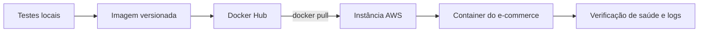

# Aula 03.2: Implantação manual na AWS

O tutorial descreve um deploy manual: acessar uma instância Ubuntu por SSH,
instalar Docker, publicar uma imagem construída localmente e executá-la na
máquina remota. Todos os valores operacionais foram substituídos por marcadores.

[Voltar para a Aula 03.1](aula-03-docker.md)

## Material original

<iframe
  class="pdf-preview"
  src="../../assets/pdfs/2026-2/aula-03-tutorial-aws.pdf"
  title="Visualização do PDF da Aula 03: Tutorial AWS">
</iframe>

<div class="pdf-preview-actions" markdown>
[Abrir ou baixar o PDF](../assets/pdfs/2026-2/aula-03-tutorial-aws.pdf){ .md-button .md-button--primary }

<p class="pdf-preview-note">2 páginas. O visualizador usa o leitor de PDF do navegador.</p>
</div>

## Objetivos

- Acessar uma máquina remota por SSH.
- Preparar uma instância Ubuntu para executar Docker.
- Separar as etapas locais das etapas remotas.
- Publicar uma imagem e substituir a versão em execução.
- Fazer o processo sem expor chaves, endereços ou senhas.

## Antes de começar

Você precisa de uma instância acessível, uma chave privada obtida pelo canal
autorizado e uma imagem que possa ser publicada no Docker Hub. Não copie nenhum
desses dados para o repositório.

| Onde | Responsabilidade |
|---|---|
| Máquina local | Compilar, testar, construir e publicar a imagem |
| Instância AWS | Baixar a imagem e executar o container |
| Docker Hub | Armazenar a imagem que conecta os dois ambientes |



## Acesso por SSH

SSH, ou *Secure Shell*, permite operar o terminal de uma máquina remota por um
canal criptografado. Em Linux, macOS, WSL ou Git Bash, restrinja a chave e inicie
a conexão:

```bash
chmod 400 CAMINHO_DA_CHAVE.pem
ssh -i CAMINHO_DA_CHAVE.pem ubuntu@ENDERECO_DA_MAQUINA
```

`chmod 400` permite que apenas o proprietário leia o arquivo. O cliente SSH pode
recusar uma chave com permissões abertas demais. No Windows, use WSL ou Git Bash
para seguir o mesmo formato de comando.

!!! danger "A chave privada não faz parte do projeto"
    Um arquivo `.pem` concede acesso à infraestrutura. Não o adicione ao Git, não
    o envie em mensagens e não mostre seu conteúdo ou caminho em capturas públicas.

## Instalação do Docker na instância

Na sessão remota, siga a documentação oficial para instalar o
[Docker Engine no Ubuntu](https://docs.docker.com/engine/install/ubuntu/). Depois,
adicione o usuário da instância ao grupo Docker e atualize a sessão:

```bash
sudo usermod -aG docker ubuntu
newgrp docker
docker version
```

O primeiro comando altera os grupos do usuário. `newgrp docker` aplica o novo
grupo à sessão atual. `docker version` confirma que cliente e serviço Docker estão
disponíveis antes do deploy.

## Construção e publicação local

Na raiz da aplicação, execute o build e produza a imagem:

```bash
./mvnw clean package
docker build -t USUARIO/minha-app:VERSAO .
docker push USUARIO/minha-app:VERSAO
```

No Windows, o projeto pode usar `mvnw.cmd` em vez de `./mvnw`. Uma etiqueta de
versão explícita torna o deploy reproduzível e permite identificar exatamente o
artefato em execução.

O build da aplicação ocorre antes do build da imagem quando o `Dockerfile` espera
o arquivo gerado pelo Maven. Se o projeto usa um build em múltiplas etapas, essa
compilação pode estar dentro do próprio `Dockerfile`.

## Execução na instância

De volta ao terminal remoto:

```bash
docker pull USUARIO/minha-app:VERSAO
docker run --name app \
  -p 8080:8080 \
  USUARIO/minha-app:VERSAO
```

Em outro terminal, ou depois de executar em segundo plano com `-d`, inspecione:

```bash
docker ps --all
docker logs app
```

Para substituir a versão:

```bash
docker stop app
docker rm app
docker pull USUARIO/minha-app:NOVA_VERSAO
docker run --name app -p 8080:8080 USUARIO/minha-app:NOVA_VERSAO
```

Parar e remover o container antigo libera o nome `app`. O `pull` garante que a
versão desejada existe localmente antes da nova execução.

## Verificação e reversão

Um deploy só termina depois que a nova versão responde e seus sinais básicos são
verificados.

| Etapa | Comando ou ação | Resultado esperado |
|---|---|---|
| Confirmar execução | `docker ps` | Container aparece como ativo |
| Inspecionar inicialização | `docker logs app` | Aplicação inicia sem erro inesperado |
| Exercitar a API | Consultar o endpoint público autorizado | Resposta compatível com a versão |
| Conferir versão | Comparar a tag implantada | Artefato esperado está em execução |

Se a verificação falhar, remova o container novo e execute novamente a tag
anterior, que deve continuar disponível no registro:

```bash
docker stop app
docker rm app
docker pull USUARIO/minha-app:VERSAO_ANTERIOR
docker run --name app -p 8080:8080 USUARIO/minha-app:VERSAO_ANTERIOR
```

Usar apenas `latest` dificulta a reversão porque o nome não identifica qual
artefato funcionava antes.

## Configuração e segurança

Se a aplicação exigir variáveis de ambiente, mantenha apenas nomes e marcadores
na documentação:

```bash
docker run --name app \
  -e NOME_DA_VARIAVEL=VALOR_FORNECIDO_EM_AMBIENTE_SEGURO \
  -p 8080:8080 \
  USUARIO/minha-app:VERSAO
```

Senhas reais não devem aparecer no comando compartilhado, em arquivos rastreados
ou no histórico do shell. Em um ambiente de produção, use gestão de segredos,
restrição de portas, atualização da instância e permissões mínimas.

## Limite do fluxo manual

O processo manual deixa claras as etapas do deploy, mas depende de uma pessoa e
é fácil executar comandos fora de ordem. Um pipeline de entrega deve automatizar
testes, construção, publicação e implantação, além de interromper a sequência
quando uma validação falhar. Esse caminho é retomado na
[Aula 04](aula-04-confiabilidade.md).

## Continuidade

- [Voltar para Docker, imagens e containers](aula-03-docker.md).
- [Continuar para a Aula 04: Confiabilidade](aula-04-confiabilidade.md).
- Consultar a [referência rápida de máquinas AWS](../referencias/aws.md).
