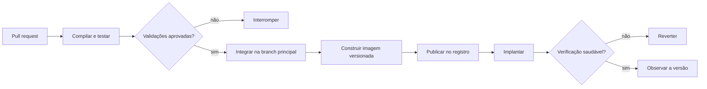
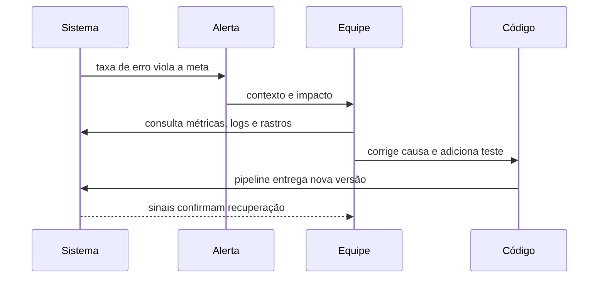

# Aula 04.2: Entrega e observabilidade

[Voltar para a Aula 04](aula-04-confiabilidade.md)

Testes reduzem riscos conhecidos, mas não garantem que o artefato correto será
implantado nem revelam tudo o que acontece com usuários reais. Entrega contínua
e observabilidade conectam mudança, execução e aprendizado.

## Objetivos

- Diferenciar integração, entrega e implantação contínuas.
- Organizar um pipeline que interrompa promoção insegura.
- Escolher sinais técnicos e de negócio.
- Transformar incidentes em testes, alertas e decisões melhores.

## Do processo manual ao pipeline

Na [Aula 03.2](aula-03-tutorial-aws.md), uma pessoa executa build, publicação,
acesso remoto e substituição do container. O fluxo ensina cada etapa, mas depende
de memória e pode usar versões diferentes entre ambientes.

### Antes: sequência dependente da pessoa

```text
executar alguns testes → construir localmente → publicar latest
→ acessar a máquina → substituir o container → observar manualmente
```

### Depois: critérios de promoção explícitos



| Prática | Resultado |
|---|---|
| Integração contínua | Mudanças pequenas recebem validação frequente |
| Entrega contínua | Um artefato aprovado permanece pronto para implantação |
| Implantação contínua | Toda mudança aprovada pode chegar automaticamente ao ambiente |

Automação melhora repetibilidade e rastreabilidade, mas também precisa ser
testada. Permissões excessivas, dependências sem versão e ausência de rollback
transformam o pipeline em uma nova fonte de risco.

!!! tip "Quando automatizar"
    Automatize etapas repetitivas com entrada e resultado verificáveis, começando
    por build, testes e criação do artefato.

!!! warning "Quando manter aprovação"
    Uma etapa manual pode ser adequada quando existe risco regulatório, impacto
    elevado ou evidência ainda insuficiente para uma promoção automática.

!!! info "Custo introduzido"
    Pipelines exigem manutenção, permissões, ambientes, tempo de execução e uma
    estratégia para diagnosticar falhas da própria automação.

## Observar o resultado para o usuário

Monitorar uma máquina responde se CPU, memória e processo parecem saudáveis.
Observabilidade ajuda a compreender por que o sistema chegou a determinado estado
a partir de logs, métricas e rastreamento.

| Sinal | Pergunta | Exemplo no checkout |
|---|---|---|
| Logs | O que aconteceu em um evento? | Pedido, versão e código do erro |
| Métricas | O comportamento mudou no tempo? | Latência e taxa de confirmação |
| Rastreamento | Onde a requisição gastou tempo? | Chamada lenta ao pagamento |
| Alerta | Alguém precisa agir agora? | Erros acima do limite por cinco minutos |

Métricas de infraestrutura são necessárias, mas não revelam uma cobrança
duplicada. O e-commerce também deve acompanhar pedidos inconsistentes, taxa de
aprovação, respostas por código HTTP e diferença entre pedidos criados e pagos.

### Antes: mensagem sem contexto

```java
try {
    gateway.cobrar(pedido);
} catch (Exception error) {
    logger.error("erro no pagamento");
}
```

### Depois: contexto seguro e acionável

```java
try {
    gateway.cobrar(pedido);
    metricas.incrementar("pagamento_aprovado");
} catch (GatewayIndisponivelException error) {
    logger.error(
        "pagamento_indisponivel pedido={} correlacao={}",
        pedido.id(), contexto.correlacao()
    );
    metricas.incrementar("pagamento_indisponivel");
    throw error;
}
```

O registro identifica evento e correlação sem incluir cartão, senha ou corpo
completo da requisição. A métrica permite observar tendência; o log preserva
contexto para investigar uma ocorrência.

!!! tip "Quando criar um alerta"
    Alerte quando existir impacto relevante, urgência e uma ação que a equipe
    possa executar. Painéis e relatórios atendem investigações sem urgência.

!!! warning "Quando não registrar"
    Não registre segredo, token, dado de cartão ou informação pessoal apenas para
    facilitar diagnóstico. Colete o mínimo necessário e controle acesso e
    retenção.

!!! info "Custo introduzido"
    Telemetria consome armazenamento, processamento e atenção. Sinais sem dono ou
    ação conhecida produzem ruído e dessensibilizam a equipe.

## Do incidente ao aprendizado



Um incidente deve produzir aprendizado proporcional: novo teste para a regressão,
alerta melhor quando a detecção foi tardia, documentação operacional quando a
resposta foi confusa ou revisão arquitetural quando a causa é estrutural.

## Encerramento do módulo

- [Voltar para a visão geral de Confiabilidade](aula-04-confiabilidade.md).
- [Revisitar testes, erros e idempotência](aula-04-testes-erros.md).
- [Consultar a visão geral de todas as aulas](index.md).
