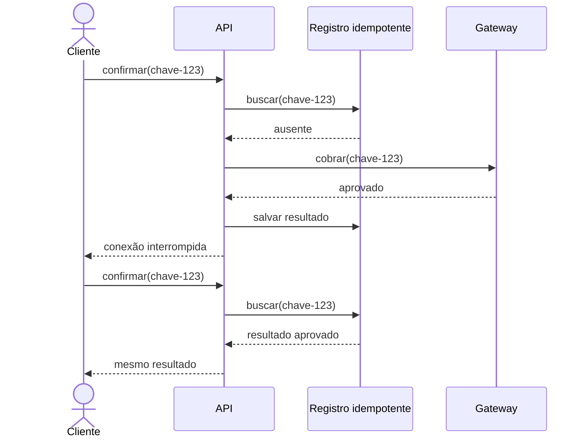

# Aula 04.1: Testes, erros e idempotência

[Voltar para a Aula 04](aula-04-confiabilidade.md)

O checkout precisa preservar regras de negócio e produzir respostas previsíveis
mesmo quando uma entrada é inválida, uma dependência falha ou o cliente repete a
operação.

## Objetivos

- Escolher níveis de teste a partir do risco.
- Separar condições conhecidas de falhas inesperadas.
- Manter contratos HTTP estáveis.
- Evitar efeitos duplicados com idempotência.

## Testar o risco, não apenas o método

| Nível | Escopo | Risco que ajuda a localizar |
|---|---|---|
| Unidade | Regra ou componente isolado | Cálculo ou transição de estado incorreta |
| Integração | Banco, fila ou serviço externo | Contrato e configuração incompatíveis |
| Ponta a ponta | Fluxo como o usuário executa | Falha entre várias camadas |

Testes rápidos e isolados oferecem retorno frequente. Testes integrados aumentam
confiança nas fronteiras, mas custam mais para preparar e diagnosticar. O conjunto
deve refletir os riscos do sistema, não uma proporção rígida.

### Antes: teste sem comportamento observável

```java
@Test
void criaPedido() {
    Pedido pedido = service.criar(requisicao);

    assertNotNull(pedido);
}
```

O teste passa mesmo se o total estiver errado, o cupom for ignorado ou o pedido
começar em um estado inválido.

### Depois: regra importante explícita

```java
@Test
void aplicaCupomUmaVezAoCriarPedido() {
    Pedido pedido = service.criar(new CriarPedido(
        List.of(new Item("livro", new BigDecimal("100.00"))),
        "MENOS10"
    ));

    assertEquals(new BigDecimal("90.00"), pedido.total());
    assertEquals(StatusPedido.CRIADO, pedido.status());
}
```

O nome descreve o cenário, os dados mostram a condição e as verificações cobrem
resultados relevantes. Detalhes internos continuam livres para mudar.

!!! tip "Quando usar cada nível"
    Use unidade para combinações de regra, integração para contratos reais e
    ponta a ponta para poucos fluxos críticos, como confirmar uma compra.

!!! warning "Quando não ampliar a suíte"
    Não replique o mesmo cenário em todos os níveis sem um risco específico. A
    duplicação aumenta tempo e manutenção sem necessariamente aumentar confiança.

!!! info "Custo introduzido"
    Testes exigem dados, ambientes e diagnóstico. Testes instáveis ou acoplados a
    detalhes reduzem a confiança e atrasam mudanças legítimas.

## Contratos de erro

Tratar um erro não significa esconder a exceção. A aplicação decide onde
recuperar, onde converter uma condição conhecida e onde interromper o fluxo.

| Situação | Código comum | Ação esperada do consumidor |
|---|---:|---|
| Entrada inválida | `400` | Corrigir os dados antes de repetir |
| Identidade ausente ou inválida | `401` | Autenticar novamente |
| Operação não permitida | `403` | Não repetir com a mesma identidade |
| Recurso inexistente | `404` | Corrigir o identificador |
| Conflito com o estado atual | `409` | Atualizar a visão do estado |
| Falha inesperada | `500` | Não assumir que a entrada é inválida |

### Antes: toda falha parece sucesso

```java
public ResponseEntity<String> criar(CriarPedido request) {
    try {
        service.criar(request);
        return ResponseEntity.ok("pedido criado");
    } catch (Exception error) {
        return ResponseEntity.ok("erro: " + error.getMessage());
    }
}
```

O status `200` prejudica clientes e monitoramento. A mensagem pode ainda expor
detalhes internos ou dados sensíveis.

### Depois: condição conhecida vira resposta estável

```java
public ResponseEntity<PedidoDto> criar(CriarPedido request) {
    Pedido pedido = service.criar(request);
    return ResponseEntity.status(HttpStatus.CREATED)
        .body(PedidoDto.from(pedido));
}

@ExceptionHandler(CupomInvalidoException.class)
ResponseEntity<ErroDto> tratarCupom(CupomInvalidoException error) {
    return ResponseEntity.badRequest()
        .body(new ErroDto("cupom_invalido", error.getMessage()));
}
```

Falhas inesperadas devem ser registradas com um identificador de correlação e
convertidas em resposta genérica, sem devolver rastreamento de pilha ou segredo.

!!! tip "Quando criar um erro específico"
    Modele uma condição quando o consumidor consegue tomar uma ação diferente e
    o contrato precisa permanecer estável.

!!! warning "Quando não recuperar"
    Não continue silenciosamente quando o estado pode estar inconsistente. Algumas
    falhas exigem interromper a operação e preservar evidência para diagnóstico.

!!! info "Custo introduzido"
    Um catálogo de erros precisa de nomes, documentação, testes e compatibilidade
    com consumidores.

## Idempotência no checkout

Uma conexão pode cair depois que o pagamento foi aceito e antes que o cliente
receba a resposta. Repetir a mesma requisição não deve produzir uma segunda
cobrança.

### Antes: cada tentativa cria um novo efeito

```java
public Pagamento confirmar(Checkout checkout) {
    return gateway.cobrar(checkout.total(), checkout.cartao());
}
```

### Depois: a chave identifica a operação lógica

```java
public Pagamento confirmar(String chaveIdempotencia, Checkout checkout) {
    return pagamentos.buscarPorChave(chaveIdempotencia)
        .orElseGet(() -> cobrarERegistrar(chaveIdempotencia, checkout));
}

private Pagamento cobrarERegistrar(String chave, Checkout checkout) {
    Pagamento pagamento = gateway.cobrar(chave, checkout.total());
    return pagamentos.salvar(chave, pagamento);
}
```

O armazenamento deve garantir unicidade da chave. Em uma aplicação real, a
equipe também precisa decidir duração, concorrência, resposta em processamento e
recuperação quando cobrar e persistir não formam uma única transação.



!!! tip "Quando usar"
    Use em operações com efeito relevante que podem ser repetidas por cliente,
    rede, fila ou política de nova tentativa.

!!! warning "Quando não confundir"
    Idempotência não substitui validação nem transforma duas compras diferentes
    em uma. A chave deve representar uma única intenção do usuário.

!!! info "Custo introduzido"
    É necessário armazenar chaves, controlar concorrência, expirar registros e
    definir o comportamento de tentativas ainda em processamento.

## Próximo passo

Depois de proteger regras e contratos, automatize a promoção do artefato e
observe o resultado na
[Aula 04.2: Entrega e observabilidade](aula-04-entrega-observabilidade.md).
