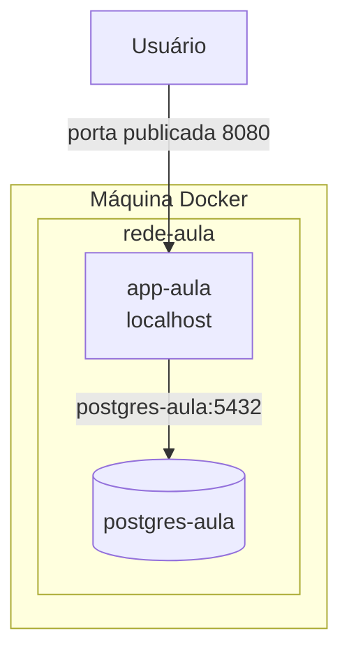
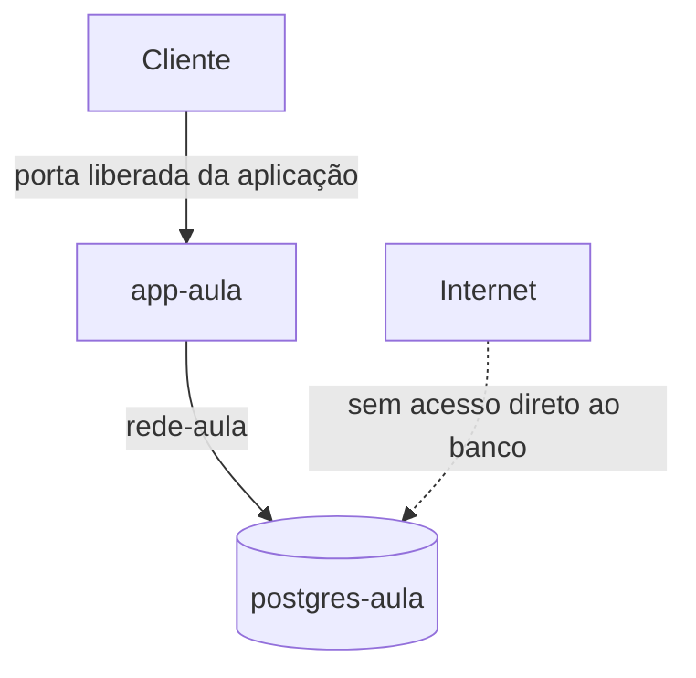

# Aula 05: Redes Docker

Esta aula explica por que uma aplicação Java consegue acessar o PostgreSQL por
`localhost` quando roda na máquina, mas perde essa conexão quando passa a rodar
em um container. A solução é colocar os containers em uma rede Docker e usar o
nome do container como endereço do banco.

## Material original

<iframe
  class="pdf-preview"
  src="../../assets/pdfs/2026-2/aula-05-redes-docker.pdf"
  title="Visualização do PDF da Aula 05: Redes Docker">
</iframe>

<div class="pdf-preview-actions" markdown>
[Abrir ou baixar o PDF](../assets/pdfs/2026-2/aula-05-redes-docker.pdf){ .md-button .md-button--primary }

<p class="pdf-preview-note">3 páginas. O visualizador usa o leitor de PDF do navegador.</p>
</div>

## Objetivos

- Distinguir a rede da máquina da rede interna de cada container.
- Entender por que `localhost` muda de significado dentro de um container.
- Criar uma rede bridge definida pelo usuário.
- Conectar uma aplicação Spring Boot a um container PostgreSQL.
- Substituir endereços fixos por variáveis de ambiente.
- Levar a mesma topologia para uma máquina AWS sem expor o banco publicamente.

## O problema com `localhost`

Cada container possui seu próprio espaço de rede. Quando a aplicação Java roda
dentro de um container, `localhost` aponta para esse mesmo container. Ele não
representa a máquina hospedeira nem o container do PostgreSQL.

| Onde a aplicação roda | Endereço do PostgreSQL | Motivo |
|---|---|---|
| Diretamente na máquina | `localhost:5432` | A porta do banco foi publicada na máquina |
| No container `app-aula` | `postgres-aula:5432` | O DNS interno resolve o nome do outro container |
| Em outra máquina | Nome ou endereço da máquina | A rede Docker local não atravessa máquinas |



O nome `postgres-aula` funciona como hostname porque redes Docker definidas pelo
usuário possuem resolução DNS entre os containers conectados. Essa descoberta de
serviço elimina a necessidade de descobrir o endereço IP efêmero do container.

## Parte 1: executar o PostgreSQL

O primeiro experimento publica a porta `5432` do PostgreSQL na máquina. Isso
permite executar a aplicação Java fora do Docker e acessar o banco por
`localhost:5432`.

```bash
docker run -d \
  --name postgres-aula \
  -e POSTGRES_DB=auladb \
  -e POSTGRES_USER=usuario \
  -e POSTGRES_PASSWORD=senha-local \
  -p 5432:5432 \
  postgres
```

O projeto Spring Boot precisa do driver JDBC do PostgreSQL:

```xml
<dependency>
  <groupId>org.postgresql</groupId>
  <artifactId>postgresql</artifactId>
  <scope>runtime</scope>
</dependency>
```

Uma configuração direta em `application.properties` fica assim:

```properties
spring.datasource.url=jdbc:postgresql://localhost:5432/auladb
spring.datasource.username=usuario
spring.datasource.password=senha-local

spring.jpa.hibernate.ddl-auto=update
spring.jpa.show-sql=true
spring.jpa.properties.hibernate.format_sql=true
```

Quando a aplicação também é colocada em um container, essa configuração deixa de
funcionar. O PostgreSQL não está no `localhost` do container da aplicação.

## Parte 2: conectar os containers

Crie uma rede bridge definida pelo usuário:

```bash
docker network create -d bridge rede-aula
```

Recrie o PostgreSQL conectado a essa rede:

```bash
docker stop postgres-aula
docker rm postgres-aula

docker run -d \
  --name postgres-aula \
  --network rede-aula \
  -e POSTGRES_DB=auladb \
  -e POSTGRES_USER=usuario \
  -e POSTGRES_PASSWORD=senha-local \
  -p 5432:5432 \
  postgres
```

Agora a URL usada pela aplicação em Docker deve trocar `localhost` pelo nome do
container do banco:

```properties
spring.datasource.url=jdbc:postgresql://postgres-aula:5432/auladb
spring.datasource.username=usuario
spring.datasource.password=senha-local
```

O `--network rede-aula` deve aparecer também no `docker run` da aplicação:

```bash
docker run -d \
  --name app-aula \
  --network rede-aula \
  -p 8080:8080 \
  USUARIO/minha-app:TAG
```

!!! note "Publicar porta e conectar à rede são operações diferentes"

    `-p 5432:5432` torna o banco acessível pela máquina hospedeira. Ele não cria
    a comunicação entre containers. Para a aplicação acessar o PostgreSQL pelo
    nome, os dois containers precisam estar na mesma rede.

## Parte 3: configurar por variáveis de ambiente

Trocar manualmente o arquivo entre a execução local e o container é frágil. O
Spring permite definir valores padrão e sobrescrevê-los com variáveis de
ambiente:

```properties
spring.datasource.url=jdbc:postgresql://${DB_HOST:localhost}:${DB_PORT:5432}/${DB_NAME:auladb}
spring.datasource.username=${DB_USER:usuario}
spring.datasource.password=${DB_PASSWORD}

spring.jpa.hibernate.ddl-auto=update
spring.jpa.show-sql=true
```

Os valores depois de `:` são padrões. Assim, `DB_HOST` usa `localhost` quando a
variável não existe. A senha não recebe um padrão para evitar que uma credencial
seja incorporada ao código.

Ao executar a aplicação em Docker, forneça a configuração do ambiente:

```bash
docker run -d \
  --name app-aula \
  --network rede-aula \
  -p 8080:8080 \
  -e DB_HOST=postgres-aula \
  -e DB_PORT=5432 \
  -e DB_NAME=auladb \
  -e DB_USER=usuario \
  -e DB_PASSWORD=senha-local \
  USUARIO/minha-app:TAG
```

Os valores são didáticos. Em um ambiente real, não coloque senhas no repositório
nem no histórico do terminal. Use o mecanismo de segredos da plataforma.

## Diagnóstico

Quando a conexão falhar, verifique a topologia antes de alterar o código:

```bash
docker ps --all
docker network inspect rede-aula
docker logs postgres-aula
docker logs app-aula
```

| Sintoma | Causa provável | Verificação |
|---|---|---|
| `Connection refused` em `localhost` | A aplicação procura o banco no próprio container | Conferir `DB_HOST` |
| Nome do banco não é resolvido | Containers estão em redes diferentes | `docker network inspect rede-aula` |
| Autenticação recusada | Usuário, senha ou banco não coincidem | Comparar as variáveis dos dois containers |
| Porta da aplicação não responde | Porta não publicada ou processo encerrado | `docker ps` e `docker logs app-aula` |

## Parte 4: levar para a máquina AWS

Na máquina AWS, repita a mesma topologia: crie a rede e execute os dois
containers conectados a ela. Publique somente a porta necessária para acessar a
aplicação. O PostgreSQL pode permanecer acessível apenas pela rede Docker.



Esse arranjo reduz a superfície exposta, mas não substitui backup, persistência
de dados, controle de acesso e gerenciamento seguro de segredos.

## Continuidade da trilha

- Revise a [Aula 03.1](aula-03-docker.md) para imagens, containers e comandos
  básicos.
- Consulte a [referência rápida de Docker](../referencias/docker.md) durante o
  laboratório.
- Use o fluxo de acesso da [Aula 03.2](aula-03-tutorial-aws.md) para executar o
  exercício na máquina AWS.
